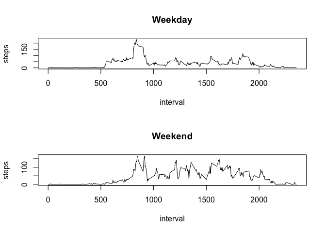

# Reproducible Research: Peer Assessment 1


## Loading and preprocessing the data
Read in the source dataset into R for analysis:

```r
library(dplyr)
```

```
## 
## Attaching package: 'dplyr'
```

```
## The following objects are masked from 'package:stats':
## 
##     filter, lag
```

```
## The following objects are masked from 'package:base':
## 
##     intersect, setdiff, setequal, union
```

```r
activity_raw_data <- read.csv("activity.csv")
activity_raw_data$date <- as.Date(activity_raw_data$date)
```

## What is mean total number of steps taken per day?
Calculate number of steps taken per day (ignoring NA values):

```r
steps_by_date <- aggregate(activity_raw_data$steps, by=list(activity_raw_data$date), sum)
colnames(steps_by_date) <- c("Date", "Total_Steps")
```
   
Plot the total steps by date:

<!-- -->

Computing the mean and median of the total number of steps taken per day

```r
mean(steps_by_date$Total_Steps, na.rm = TRUE)
```

```
## [1] 10766.19
```

```r
median(steps_by_date$Total_Steps, na.rm = TRUE)
```

```
## [1] 10765
```


## What is the average daily activity pattern?
Compute average number of steps across all days per interval:

```r
steps_by_interval <- activity_raw_data %>% group_by(interval) %>% summarise(steps = mean(steps, na.rm=TRUE))
```

Plot the average steps by interval:
<!-- -->

Which 5-minute interval, on average across all the dats in the dataset, contains the maximum number of steps?

```r
steps_by_interval[which.max(steps_by_interval$steps), ]
```

```
## # A tibble: 1 x 2
##   interval    steps
##      <int>    <dbl>
## 1      835 206.1698
```


## Imputing missing values
The dataset has a total of 2304 observations that are missing values for number of steps as calculated with sum(is.na(activity_raw_data$steps))
For those observations we can use the mean number of steps for that specific interval across all days in our data set:


```r
replace_NA <- function(data) {
        obs <- nrow(data)  ## get total rows in raw data set
        n <- 1
        
        ## test every row in the raw data set. if steps value is NA,
        ## look up the corresponding interval value in steps_by_interval
        ## to get the mean number of steps across all days for that interval
        ## and use it in place of NA 
        
        while (n <= obs) {     
                if (is.na(data$steps[n])) {
                        interval <- data$interval[n];
                        x <- which(steps_by_interval$interval == interval);
                        data$steps[n] <- steps_by_interval$steps[x]
                        
                }       

                n <- n + 1
        }
        assign('data',data,envir=.GlobalEnv)
} 

replace_NA(activity_raw_data)
```

Move the updated data to a new data frame called complete_data - 

```r
complete_data <- data
```

calculate number of steps taken per day (ignoring NA values):

```r
steps_by_date <- aggregate(complete_data$steps, by=list(complete_data$date), sum)
colnames(steps_by_date) <- c("Date", "Total_Steps")
```

Plot the total steps by date with the NAs replaced:
<!-- -->

Computing the mean and median of the total number of steps taken per day

```r
mean(steps_by_date$Total_Steps)
```

```
## [1] 10766.19
```

```r
median(steps_by_date$Total_Steps)
```

```
## [1] 10766.19
```


## Are there differences in activity patterns between weekdays and weekends?
Add a colunm to complete_data called is_weekday to indicate if the observation is from a weekday or weekend day:

```r
weekend <- c("Saturday", "Sunday")
complete_data$is_weekday <- factor((weekdays(complete_data$date) %in% weekend), levels = c(TRUE, FALSE), labels=c('Weekend', 'Weekday'))

steps_by_interval <- complete_data %>% group_by(is_weekday, interval) %>% summarise(steps = mean(steps))
```

Now plot the differences in weekend and weekday activity:
<!-- -->
